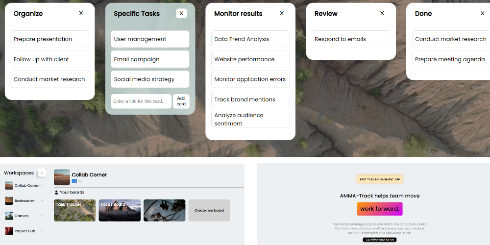

#  AMMA-Track App

AMMA-Track is a Trello clone designed to streamline task management and collaboration within teams. It provides a user-friendly interface for creating boards, lists, and cards to organize and prioritize tasks efficiently.

# 

## Features

- **Create Boards:** Represent different projects or categories.
- **Organize Lists:** Efficiently manage tasks within boards using lists.
- **Break Down Tasks:** Create individual cards for each task with unique details and comments.

